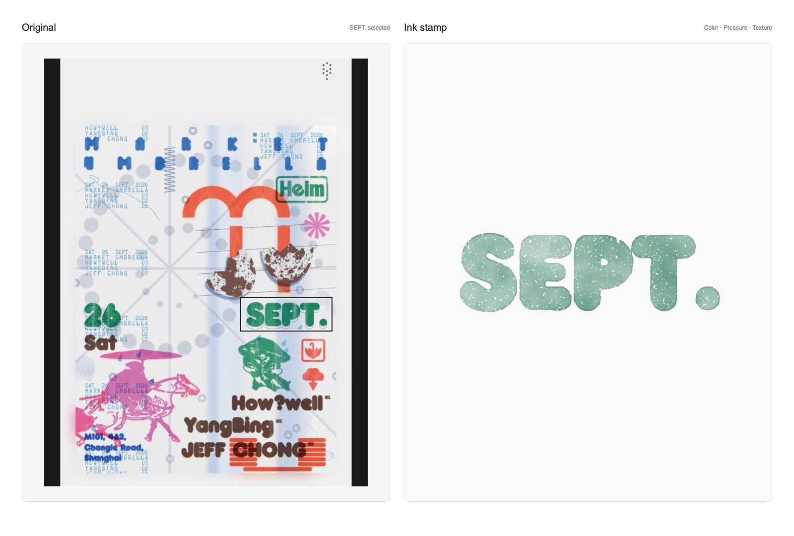

# Only Ink Stamp

**English** · [简体中文](README.zh-CN.md)

The first tool in the only-xxx series: turn your favorite images into ink stamps.

## Start with the skill

**1. Install once.** Paste this into Codex:

```text
Install the Codex skill from https://github.com/SummonLav/only-ink-stamp.
```

**2. Attach an image and run it.** For the example below:

```text
Use $ink-stamp to turn the MetroCard in the top right of this image into a pink ink stamp using luminance extraction. Keep the text readable, vary the ink density, and make parts of the edges darker.
```

To choose the region and tune the result yourself, ask `$ink-stamp` to open the studio. The skill handles dependency setup and launches the local tool; you do not need to run server commands manually. Python 3.10+ is required.

<details>
<summary>Manual skill installation</summary>

```sh
git clone https://github.com/SummonLav/only-ink-stamp.git ~/.codex/skills/ink-stamp
```

See [SKILL.md](SKILL.md) for the workflow and parameter reference.

</details>

## Play in your browser

The web studio runs entirely in your browser: choose an image, select a region, adjust the ink, and download the result. No Python installation, account, or image upload is needed. “Save bundle” downloads a ZIP with the transparent PNG, paper preview, original image, and settings.

### Deploy to Vercel

Import this repository with **Root Directory left empty**, **Framework Preset: Other**, and the included `vercel.json`. It builds the static studio into `dist`; the `scripts` folder is not the project root. The default example is the pink MetroCard using luminance extraction.

To build and preview the same web version locally (Node.js 20+):

```sh
npm run build
python3 -m http.server 8080 --directory dist
```

Open `http://localhost:8080` in a current browser. Uploaded images stay in this tab; download a bundle before closing it. The browser and Python renderers share settings but use different texture generators. For an identical impression, reuse the same renderer, image, size, settings, and seed.

## Before → After



The outline marks the MetroCard in the top right of the original image. The pink stamp on the right comes from that selection using luminance extraction, with adjustable ink density, darker edges, and worn patches.

[Original image](docs/images/source.png) · [Transparent stamp PNG](docs/images/stamp.png) · [Example settings](docs/examples/metrocard.json)

## What you can do

- **Pick a shape.** Use a rectangle, a freehand lasso, or precise selection coordinates.
- **Choose your ink.** Use a preset or custom color, or sample a color from the source to extract it.
- **Adjust the pressure.** Control overall ink density and uneven coverage independently.
- **Pool ink along the edges.** Adjust both the strength and the irregular distribution of darker edges.
- **Add a little imperfection.** Dial in grain, wear, and subtle bleed, or generate another impression.
- **Keep the result.** Export a transparent PNG, a paper preview, and reusable JSON settings.

A monochrome interface keeps the original and result side by side. Images are processed locally. No account or API key required.

## Run locally

Requires Python 3.10+. On macOS or Linux:

```sh
git clone https://github.com/SummonLav/only-ink-stamp.git
cd only-ink-stamp

python3 -m venv .venv
.venv/bin/python -m pip install -r scripts/requirements.txt
.venv/bin/python scripts/studio.py
```

Open the `STAMP_STUDIO_URL` printed in the terminal. The server picks an available port and starts with a built-in sample. Use the image picker, drag in an image, or paste one to begin.

On Windows, create the environment with `py -m venv .venv` and replace `.venv/bin/python` with `.venv\Scripts\python.exe` in subsequent commands.

To start with your own image:

```sh
.venv/bin/python scripts/studio.py \
  --input /path/to/image.png \
  --output-dir ./stamp-outputs
```

The PNG export downloads a transparent image. Saving a bundle writes the transparent image, paper preview, and settings to the output directory. Images uploaded through the studio are also saved with the bundle so you can use them again.

The studio controls currently use Chinese labels. This documentation is available in English and Chinese.

## Recreate the example

Open the example in the studio:

```sh
.venv/bin/python scripts/studio.py \
  --input docs/images/source.png \
  --preset docs/examples/metrocard.json
```

Or render it from the command line:

```sh
.venv/bin/python scripts/stamp.py docs/images/source.png \
  --preset docs/examples/metrocard.json \
  --output stamp-outputs/metrocard.png
```

This writes `metrocard.png`, `metrocard-paper.png`, and `metrocard.json`. The same input, settings, output size, and random seed produce the same result.

## Images and exports

- Automatic extraction works well with artwork on a light background. Use color extraction for multicolor collages, or preserve the alpha channel of transparent artwork.
- Photos are converted using brightness or color. Semantic subject removal is not included; use the lasso for complex backgrounds.
- Export size refers to the longest edge of the selected artwork, with an additional 8% transparent margin on each side. Previews render at up to 900 px, so grain details may differ slightly in larger exports.
- Transparent PNGs can be reused in posters, collages, or other designs.

## Checks

```sh
npm test
.venv/bin/python scripts/check_engine.py
```

The checks cover transparency, negative space, selections, ink density, edge pooling, color, and reproducible texture.
